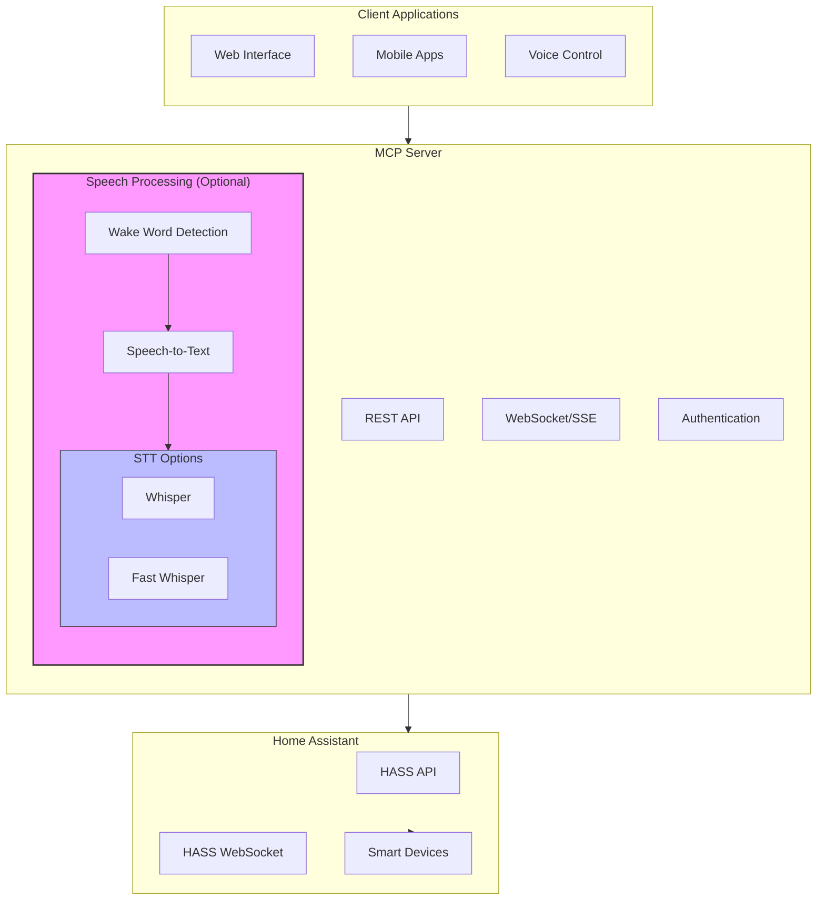

# MCP Server for Home Assistant 🏠🤖

[](LICENSE) [](https://bun.sh) [](https://www.typescriptlang.org) [](https://smithery.ai/server/@jango-blockchained/advanced-homeassistant-mcp)

## Overview 🌐

MCP (Model Context Protocol) Server is my lightweight integration tool for Home Assistant, providing a flexible interface for device management and automation. It's designed to be fast, secure, and easy to use. Built with Bun for maximum performance.

## Why Bun? 🚀

I chose Bun as the runtime for several key benefits:

- ⚡ **Blazing Fast Performance**
  - Up to 4x faster than Node.js
  - Built-in TypeScript support
  - Optimized file system operations

- 🎯 **All-in-One Solution**
  - Package manager (faster than npm/yarn)
  - Bundler (no webpack needed)
  - Test runner (built-in testing)
  - TypeScript transpiler

- 🔋 **Built-in Features**
  - SQLite3 driver
  - .env file loading
  - WebSocket client/server
  - File watcher
  - Test runner

- 💾 **Resource Efficient**
  - Lower memory usage
  - Faster cold starts
  - Better CPU utilization

- 🔄 **Node.js Compatibility**
  - Runs most npm packages
  - Compatible with Express/Fastify
  - Native Node.js APIs

## Core Features ✨

- 🔌 Basic device control via REST API
- 📡 WebSocket/Server-Sent Events (SSE) for state updates
- 🤖 Simple automation rule management
- 🔐 JWT-based authentication
- 🎤 Optional speech features:
  - 🗣️ Wake word detection ("hey jarvis", "ok google", "alexa")
  - 🎯 Speech-to-text using fast-whisper
  - 🌍 Multiple language support
  - 🚀 GPU acceleration support

## System Architecture 📊



## Prerequisites 📋

- 🚀 [Bun runtime](https://bun.sh) (v1.0.26+)
- 🏡 [Home Assistant](https://www.home-assistant.io/) instance
- 🐳 Docker (optional, recommended for deployment)
- 🖥️ Node.js 18+ (optional, for speech features)
- 🎮 NVIDIA GPU with CUDA support (optional, for faster speech processing)

## Quick Start 🚀

1. Clone my repository:
```bash
git clone https://github.com/jango-blockchained/homeassistant-mcp.git
cd homeassistant-mcp
```

2. Set up the environment:
```bash
# Make my setup script executable
chmod +x scripts/setup-env.sh

# Run setup (defaults to development)
./scripts/setup-env.sh

# Or specify an environment:
NODE_ENV=production ./scripts/setup-env.sh

# Force override existing files:
./scripts/setup-env.sh --force
```

3. Configure your settings:
- Edit `.env` file with your Home Assistant details
- Required: Add your `HASS_TOKEN` (long-lived access token)

4. Build and launch with Docker:
```bash
# Build options:
# Standard build
./docker-build.sh

# Build with speech support
./docker-build.sh --speech

# Build with speech and GPU support
./docker-build.sh --speech --gpu

# Launch:
docker compose up -d

# With speech features:
docker compose -f docker-compose.yml -f docker-compose.speech.yml up -d
```

## Docker Build Options 🐳

My Docker build script (`docker-build.sh`) supports different configurations:

### 1. Standard Build
```bash
./docker-build.sh
```
- Basic MCP server functionality
- REST API and WebSocket support
- No speech features

### 2. Speech-Enabled Build
```bash
./docker-build.sh --speech
```
- Includes wake word detection
- Speech-to-text capabilities
- Pulls required images:
  - `onerahmet/openai-whisper-asr-webservice`
  - `rhasspy/wyoming-openwakeword`

### 3. GPU-Accelerated Build
```bash
./docker-build.sh --speech --gpu
```
- All speech features
- CUDA GPU acceleration
- Optimized for faster processing
- Float16 compute type for better performance

### Build Features
- 🔄 Automatic resource allocation
- 💾 Memory-aware building
- 📊 CPU quota management
- 🧹 Automatic cleanup
- 📝 Detailed build logs
- 📊 Build summary and status

## Environment Configuration 🔧

I've implemented a hierarchical configuration system:

### File Structure 📁
1. `.env.example` - My template with all options
2. `.env` - Your configuration (copy from .env.example)
3. Environment overrides:
   - `.env.dev` - Development settings
   - `.env.prod` - Production settings
   - `.env.test` - Test settings

### Loading Priority ⚡
Files load in this order:
1. `.env` (base config)
2. Environment-specific file:
   - `NODE_ENV=development` → `.env.dev`
   - `NODE_ENV=production` → `.env.prod`
   - `NODE_ENV=test` → `.env.test`

Later files override earlier ones.

## Speech Features Setup 🎤

### Prerequisites
1. 🐳 Docker installed and running
2. 🎮 NVIDIA GPU with CUDA (optional)
3. 💾 4GB+ RAM (8GB+ recommended)

### Configuration
1. Enable speech in `.env`:
```bash
ENABLE_SPEECH_FEATURES=true
ENABLE_WAKE_WORD=true
ENABLE_SPEECH_TO_TEXT=true
WHISPER_MODEL_PATH=/models
WHISPER_MODEL_TYPE=base
```

2. Choose your STT engine:
```bash
# For standard Whisper
STT_ENGINE=whisper

# For Fast Whisper (GPU recommended)
STT_ENGINE=fast-whisper
CUDA_VISIBLE_DEVICES=0  # Set GPU device
```

### Available Models 🤖
Choose based on your needs:
- `tiny.en`: Fastest, basic accuracy
- `base.en`: Good balance (recommended)
- `small.en`: Better accuracy, slower
- `medium.en`: High accuracy, resource intensive
- `large-v2`: Best accuracy, very resource intensive

## Development 💻

```bash
# Install dependencies
bun install

# Run in development mode
bun run dev

# Run tests
bun test

# Run with hot reload
bun --hot run dev

# Build for production
bun build ./src/index.ts --target=bun

# Run production build
bun run start
```

### Performance Comparison 📊

| Operation | Bun | Node.js |
|-----------|-----|---------|
| Install Dependencies | ~2s | ~15s |
| Cold Start | 300ms | 1000ms |
| Build Time | 150ms | 4000ms |
| Memory Usage | ~150MB | ~400MB |

## Documentation 📚

### Core Documentation
- [Configuration Guide](docs/configuration.md)
- [API Documentation](docs/api.md)
- [Troubleshooting](docs/troubleshooting.md)

### Advanced Features
- [Natural Language Processing](docs/nlp.md) - AI-powered automation analysis and control
- [Custom Prompts Guide](docs/prompts.md) - Create and customize AI behavior
- [Extras & Tools](docs/extras.md) - Additional utilities and advanced features

### Extra Tools 🛠️

I've included several powerful tools in the `extra/` directory to enhance your Home Assistant experience:

1. **Home Assistant Analyzer CLI** (`ha-analyzer-cli.ts`)
   - Deep automation analysis using AI models
   - Security vulnerability scanning
   - Performance optimization suggestions
   - System health metrics

2. **Speech-to-Text Example** (`speech-to-text-example.ts`)
   - Wake word detection
   - Speech-to-text transcription
   - Multiple language support
   - GPU acceleration support

3. **Claude Desktop Setup** (`claude-desktop-macos-setup.sh`)
   - Automated Claude Desktop installation for macOS
   - Environment configuration
   - MCP integration setup

See [Extras Documentation](docs/extras.md) for detailed usage instructions and examples.

## Client Integration 🔗

### Cursor Integration 🖱️
Add to `.cursor/config/config.json`:
```json
{
  "mcpServers": {
    "homeassistant-mcp": {
      "command": "bun",
      "args": ["run", "start"],
      "cwd": "${workspaceRoot}",
      "env": {
        "NODE_ENV": "development"
      }
    }
  }
}
```

### Claude Desktop 💬
Add to your Claude config:
```json
{
  "mcpServers": {
    "homeassistant-mcp": {
      "command": "bun",
      "args": ["run", "start", "--port", "8080"],
      "env": {
        "NODE_ENV": "production"
      }
    }
  }
}
```

### Command Line 💻
Windows users can use the provided script:
1. Go to `scripts` directory
2. Run `start_mcp.cmd`

## License 📄

MIT License. See [LICENSE](LICENSE) for details.

## Author 👨‍💻

Created by [jango-blockchained](https://github.com/jango-blockchained)
