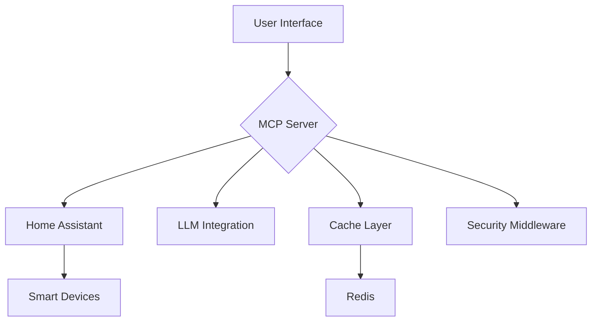

# 🚀 Model Context Protocol (MCP) Server for Home Assistant

The **Model Context Protocol (MCP) Server** is a robust, secure, and high-performance bridge that integrates Home Assistant with Language Learning Models (LLMs), enabling natural language control and real-time monitoring of your smart home devices. Unlock advanced automation, control, and analytics for your Home Assistant ecosystem.


[](https://jango-blockchained.github.io/homeassistant-mcp/)


## 🌟 Key Benefits

### 🎮 Device Control & Monitoring
- **Voice-like Control:** "Dim living room lights to 50%" 🌇
- **Real-time Updates:** WebSocket/SSE with <100ms latency ⚡
- **Cross-Device Automation:** Create scene-based rules 🎭

### 🤖 AI-Powered Features
- Natural language processing for commands
- Predictive automation suggestions
- Anomaly detection in device behavior

## 🏗 Architecture Overview



## 🛠 Installation

### 🐳 Docker Setup (Recommended)

```bash
# 1. Clone repo with caching
git clone --depth 1 https://github.com/jango-blockchained/homeassistant-mcp.git

# 2. Configure environment
cp .env.example .env  # Edit with your HA details 🔧

# 3. Start with compose
docker compose up -d --build  # Auto-scaling enabled 📈

# View real-time logs 📜
docker compose logs -f --tail=50
```

### 📦 Bare Metal Installation

```bash
# Install Bun (if missing)
curl -fsSL https://bun.sh/install | bash  # 🐇 Fast runtime

# Install dependencies with cache
bun install --frozen-lockfile  # ♻️ Reliable dep tree

# Start in dev mode with hot-reload 🔥
bun run dev --watch
```   |

## 💡 Example Usage

```javascript
// Real-time device monitoring 🌐
const ws = new WebSocket('wss://mcp.yourha.com/ws');

ws.onmessage = ({ data }) => {
  const update = JSON.parse(data);
  if(update.entity_id === 'light.kitchen') {
    smartBulb(update.state);  // 🎛️ Update UI
  }
};
```

## 🔄 Update Strategy

```bash
# Zero-downtime updates 🕒
docker compose pull
docker compose up -d --build
docker system prune  # Clean old images 🧹
```

## 🛡 Security Features

- JWT authentication with refresh tokens 🔑
- Automatic request sanitization 🧼
- IP-based rate limiting with fail2ban integration 🚫
- End-to-end encryption support 🔒

## 🌍 Community & Support

| Platform       | Link                          | Response Time |
|----------------|-------------------------------|---------------|
| 📚 Docs        | [API Reference](docs/api.md)  | Instant       |
| 🐛 GitHub      | [Issues](#)                   | <24hr         |

## 🚧 Troubleshooting Guide

```bash
# Check service health 🩺
docker compose ps

# Test API endpoints 🔌
curl -I http://localhost:3000/healthcheck  # Should return 200 ✅

# Inspect cache status 💾
docker exec mcp_redis redis-cli info memory
```

## 🔮 Roadmap Highlights

- [ ] **AI Assistant Integration** (Q4 2024) 🤖
- [ ] **Predictive Automation** (Q1 2025) 🔮
- [x] **Real-time Analytics** (Shipped! 🚀) 
- [ ] **Energy Optimization** (Q3 2024) 🌱

## 🤝 Contributing

We love community input! Here's how to help:

1. 🍴 Fork the repository
2. 🌿 Create a feature branch
3. 💻 Make your changes
4. 🧪 Run tests: `bun test --coverage`
5. 📦 Commit using [Conventional Commits](https://www.conventionalcommits.org)
6. 🔀 Open a Pull Request

**Pro Tip:** Check our [Good First Issues](https://github.com/jango-blockchained/homeassistant-mcp/contribute) for starter tasks! 🎯

---

**📢 Note:** This project adheres to [Semantic Versioning](https://semver.org). Always check breaking changes in release notes before upgrading! ⚠️

## Table of Contents

- [Overview](#overview)
- [Key Features](#key-features)
- [Architecture & Design](#architecture--design)
- [Installation](#installation)
  - [Basic Setup](#basic-setup)
  - [Docker Setup (Recommended)](#docker-setup-recommended)
- [Usage](#usage)
- [API & Documentation](#api--documentation)
- [Development](#development)
- [Roadmap & Future Plans](#roadmap--future-plans)
- [Community & Support](#community--support)
- [Contributing](#contributing)
- [Troubleshooting & FAQ](#troubleshooting--faq)
- [License](#license)

## Overview

The MCP Server bridges Home Assistant with advanced LLM integrations to deliver intuitive control, automation, and state monitoring. Leveraging a high-performance runtime and real-time communication protocols, MCP offers a seamless experience for managing your smart home.

## Key Features

### Device Control & Monitoring
- **Smart Device Control:** Manage lights, climate, covers, switches, sensors, media players, fans, locks, vacuums, and cameras using natural language commands.
- **Real-time Updates:** Receive instant notifications and updates via Server-Sent Events (SSE).

### System & Automation Management
- **Automation Engine:** Create, modify, and trigger custom automation rules with ease.
- **Add-on & Package Management:** Integrates with HACS for deploying custom integrations, themes, scripts, and applications.
- **Robust System Management:** Features advanced state monitoring, error handling, and security safeguards.

## Architecture & Design

The MCP Server is built with scalability, resilience, and security in mind:

- **High-Performance Runtime:** Powered by Bun for fast startup, efficient memory utilization, and native TypeScript support.
- **Real-time Communication:** Employs Server-Sent Events (SSE) for continuous, real-time data updates.
- **Modular & Extensible:** Designed to support plugins, add-ons, and custom automation scripts, allowing for easy expansion.
- **Secure API Integration:** Implements token-based authentication, rate limiting, and adherence to best security practices.

For a deeper dive into the system architecture, please refer to our [Architecture Documentation](docs/architecture.md).

## Usage

Once the server is running, open your browser at [http://localhost:3000](http://localhost:3000). For real-time device updates, integrate the SSE endpoint in your application:

```javascript
const eventSource = new EventSource('http://localhost:3000/subscribe_events?token=YOUR_TOKEN&domain=light');

eventSource.onmessage = (event) => {
  const data = JSON.parse(event.data);
  console.log('Update received:', data);
};
```

## API & Documentation

Access comprehensive API details and guides in the docs directory:

- **API Reference:** [API Documentation](docs/api.md)
- **SSE Documentation:** [SSE API](docs/sse-api.md)
- **Troubleshooting Guide:** [Troubleshooting](docs/troubleshooting.md)
- **Architecture Details:** [Architecture Documentation](docs/architecture.md)

## Development

### Running in Development Mode

```bash
bun run dev
```

### Running Tests

- Execute all tests:
  ```bash
  bun test
  ```

- Run tests with coverage:
  ```bash
  bun test --coverage
  ```

### Production Build & Start

```bash
bun run build
bun start
```

## Roadmap & Future Plans

The MCP Server is under active development and improvement. Planned enhancements include:

- **Advanced Automation Capabilities:** Introducing more complex automation rules and conditional logic.
- **Enhanced Security Features:** Additional authentication layers, encryption enhancements, and security monitoring tools.
- **User Interface Improvements:** Development of a more intuitive web dashboard for easier device management.
- **Expanded Integrations:** Support for a wider array of smart home devices and third-party services.
- **Performance Optimizations:** Continued efforts to reduce latency and improve resource efficiency.

For additional details, check out our [Roadmap](docs/roadmap.md).

## Community & Support

Join our community to stay updated, share ideas, and get help:

- **GitHub Issues:** Report bugs or suggest features on our [GitHub Issues Page](https://github.com/jango-blockchained/homeassistant-mcp/issues).
- **Discussion Forums:** Connect with other users and contributors in our community forums.
- **Chat Platforms:** Join our real-time discussions on [Discord](#) or [Slack](#).

## Contributing

We welcome your contributions! To get started:

1. Fork the repository.
2. Create your feature branch:
   ```bash
   git checkout -b feature/your-feature-name
   ```
3. Install dependencies:
   ```bash
   bun install
   ```
4. Make your changes and run tests:
   ```bash
   bun test
   ```
5. Commit and push your changes, then open a Pull Request.

For detailed guidelines, see [Contributing Guide](docs/contributing.md).

## Troubleshooting & FAQ

### Common Issues

- **Connection Problems:** Ensure that your `HASS_HOST`, authentication token, and WebSocket URL are correctly configured.
- **Docker Deployment:** Confirm that Docker is running and that your `.env` file contains the correct settings.
- **Automation Errors:** Verify entity availability and review your automation configurations for potential issues.

For more troubleshooting details, refer to [Troubleshooting Guide](docs/troubleshooting.md).

### Frequently Asked Questions

**Q: What platforms does MCP Server support?**

A: MCP Server runs on Linux, macOS, and Windows (Docker is recommended for Windows environments).

**Q: How do I report a bug or request a feature?**

A: Please use our [GitHub Issues Page](https://github.com/jango-blockchained/homeassistant-mcp/issues) to report bugs or request new features.

**Q: Can I contribute to the project?**

A: Absolutely! We welcome contributions from the community. See the [Contributing](#contributing) section for more details.

## License

This project is licensed under the MIT License. See [LICENSE](LICENSE) for the full license text.

## Documentation

Full documentation is available at: [https://jango-blockchained.github.io/homeassistant-mcp/](https://jango-blockchained.github.io/homeassistant-mcp/)

## Quick Start

## Installation

## Usage
