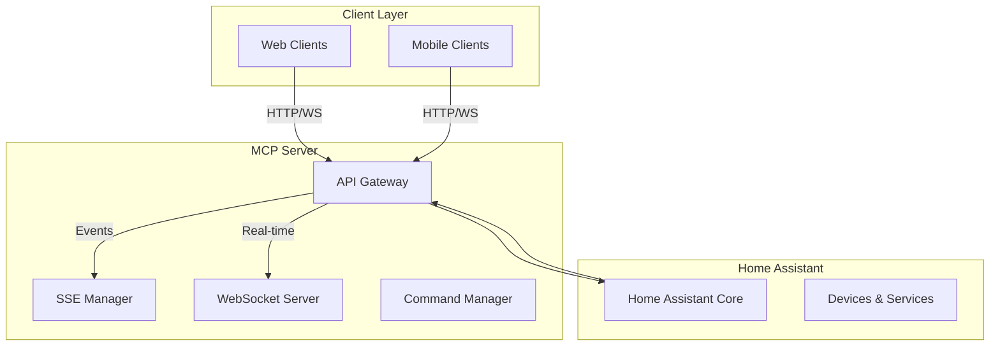

# Architecture Overview 🏗️

This document describes the architecture of the MCP Server, explaining how different components work together to provide a bridge between Home Assistant and custom automation tools.

## System Architecture

## Core Components

### API Gateway
- Handles incoming HTTP and WebSocket requests
- Provides endpoints for device management
- Implements basic authentication and request validation

### SSE Manager
- Manages Server-Sent Events for real-time updates
- Broadcasts device state changes to connected clients

### WebSocket Server
- Provides real-time, bidirectional communication
- Supports basic device control and state monitoring

### Command Manager
- Processes device control requests
- Translates API commands to Home Assistant compatible formats

## Communication Flow

1. Client sends a request to the MCP Server API
2. API Gateway authenticates the request
3. Command Manager processes the request
4. Request is forwarded to Home Assistant
5. Response is sent back to the client via API or WebSocket

## Key Design Principles

- **Simplicity:** Lightweight, focused design
- **Flexibility:** Easily extendable architecture
- **Performance:** Efficient request handling
- **Security:** Basic authentication and validation

## Limitations

- Basic device control capabilities
- Limited advanced automation features
- Minimal third-party integrations

## Future Improvements

- Enhanced error handling
- More robust authentication
- Expanded device type support

*Architecture is subject to change as the project evolves.* 