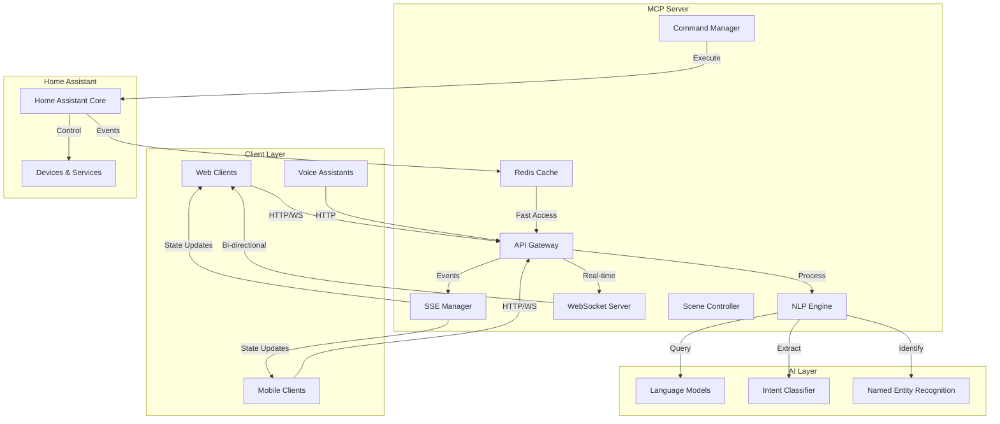
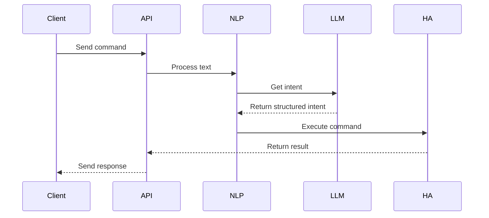
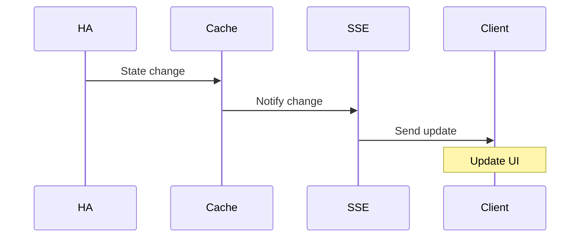
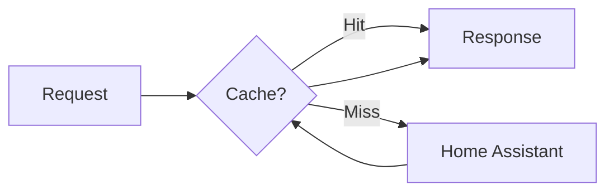
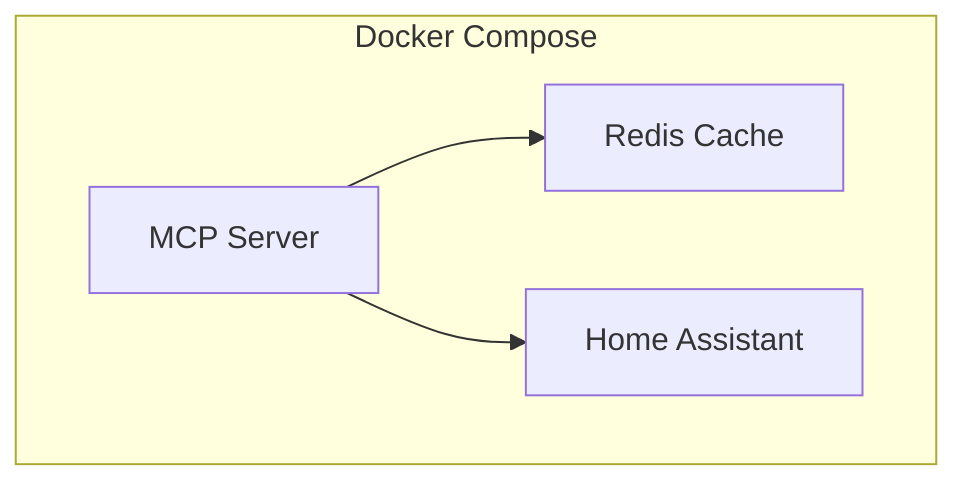

# Architecture Overview 🏗️

This document describes the architecture of the MCP Server, explaining how different components work together to provide a bridge between Home Assistant and Language Learning Models.

## System Architecture



## Component Details

### 1. Client Layer

The client layer consists of various interfaces that interact with the MCP Server:

- **Web Clients**: Browser-based dashboards and control panels
- **Mobile Clients**: Native mobile applications
- **Voice Assistants**: Voice-enabled devices and interfaces

### 2. MCP Server Core

#### API Gateway
- Handles all incoming HTTP requests
- Manages authentication and rate limiting
- Routes requests to appropriate handlers

```typescript
interface APIGateway {
    authenticate(): Promise<boolean>;
    rateLimit(): Promise<boolean>;
    route(request: Request): Promise<Response>;
}
```

#### NLP Engine
- Processes natural language commands
- Integrates with Language Models
- Extracts intents and entities

```typescript
interface NLPEngine {
    processCommand(text: string): Promise<CommandIntent>;
    extractEntities(text: string): Promise<Entity[]>;
    validateIntent(intent: CommandIntent): boolean;
}
```

#### Event Management
- **SSE Manager**: Handles Server-Sent Events
- **WebSocket Server**: Manages bi-directional communication
- **Command Manager**: Processes and executes commands

### 3. Home Assistant Integration

The server maintains a robust connection to Home Assistant through:

- REST API calls
- WebSocket connections
- Event subscriptions

```typescript
interface HomeAssistantClient {
    connect(): Promise<void>;
    getState(entityId: string): Promise<EntityState>;
    executeCommand(command: Command): Promise<CommandResult>;
    subscribeToEvents(callback: EventCallback): Subscription;
}
```

### 4. AI Layer

#### Language Model Integration
- Processes natural language input
- Understands context and user intent
- Generates appropriate responses

#### Intent Classification
- Identifies command types
- Extracts parameters
- Validates requests

## Data Flow

### 1. Command Processing



### 2. Real-time Updates



### 3. [SSE API](api/sse.md)
- Event Subscriptions
- Real-time Updates
- Connection Management

## Security Architecture

### Authentication Flow

1. **JWT-based Authentication**
   ```typescript
   interface AuthToken {
       token: string;
       expires: number;
       scope: string[];
   }
   ```

2. **Rate Limiting**
   ```typescript
   interface RateLimit {
       window: number;
       max: number;
       current: number;
   }
   ```

### Security Measures

- TLS encryption for all communications
- Input sanitization
- Request validation
- Token-based authentication
- Rate limiting
- IP filtering

## Performance Optimizations

### Caching Strategy



### Connection Management

- Connection pooling
- Automatic reconnection
- Load balancing
- Request queuing

## Configuration

The system is highly configurable through environment variables and configuration files:

```yaml
server:
  port: 3000
  host: '0.0.0.0'
  
homeAssistant:
  url: 'http://homeassistant:8123'
  token: 'YOUR_TOKEN'
  
security:
  jwtSecret: 'your-secret'
  rateLimit: 100
  
ai:
  model: 'gpt-4'
  temperature: 0.7
  
cache:
  ttl: 300
  maxSize: '100mb'
```

## Deployment Architecture

### Docker Deployment



### Scaling Considerations

- Horizontal scaling capabilities
- Load balancing support
- Redis cluster support
- Multiple HA instance support

## Further Reading

- [API Documentation](api/index.md)
- [Installation Guide](getting-started/installation.md)
- [Contributing Guidelines](contributing.md)
- [Troubleshooting](troubleshooting.md) 