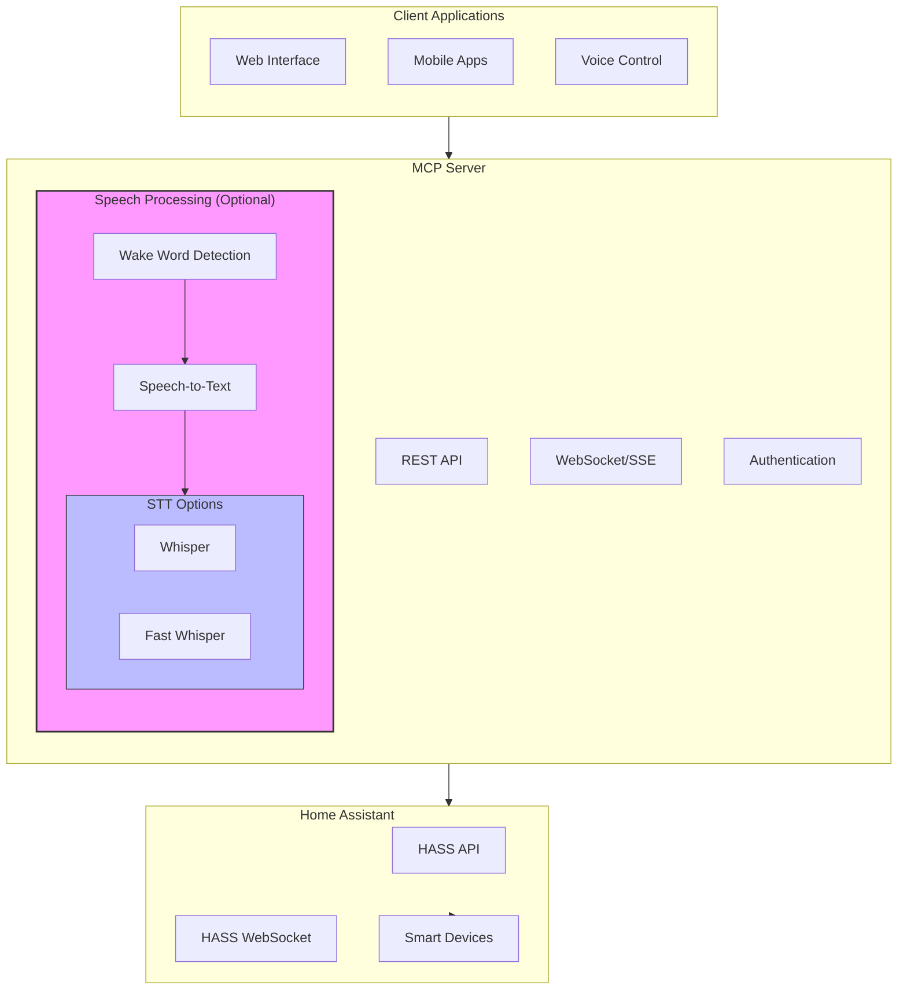

# Home Assistant MCP Documentation 🏠🤖

Welcome to the documentation for my Home Assistant MCP (Model Context Protocol) Server. This documentation will help you get started with installation, configuration, and usage of the MCP server.

## What is MCP? 🤔

MCP is a lightweight integration tool for Home Assistant that provides:

- 🔌 REST API for device control
- 📡 WebSocket/SSE for real-time updates
- 🤖 AI-powered automation analysis
- 🎤 Optional speech processing
- 🔐 Secure authentication

## Quick Links 🔗

- [Quick Start Guide](getting-started/quick-start.md)
- [Configuration Guide](getting-started/configuration.md)
- [API Reference](api/overview.md)
- [Tools & Extras](tools/overview.md)

## System Architecture 📊

## Prerequisites 📋

- 🚀 [Bun runtime](https://bun.sh) (v1.0.26+)
- 🏡 [Home Assistant](https://www.home-assistant.io/) instance
- 🐳 Docker (optional, recommended for deployment)
- 🖥️ Node.js 18+ (optional, for speech features)
- 🎮 NVIDIA GPU with CUDA support (optional, for faster speech processing)

## Why Bun? 🚀

I chose Bun as the runtime for several key benefits:

- ⚡ **Blazing Fast Performance**
  - Up to 4x faster than Node.js
  - Built-in TypeScript support
  - Optimized file system operations

- 🎯 **All-in-One Solution**
  - Package manager (faster than npm/yarn)
  - Bundler (no webpack needed)
  - Test runner (built-in testing)
  - TypeScript transpiler

- 🔋 **Built-in Features**
  - SQLite3 driver
  - .env file loading
  - WebSocket client/server
  - File watcher
  - Test runner

## Getting Started 🚀

Check out the [Quick Start Guide](getting-started/quick-start.md) to begin your journey with Home Assistant MCP!

## Key Features

### 🎮 Device Control
- Basic REST API for device management
- WebSocket and Server-Sent Events (SSE) for real-time updates
- Simple automation rule support

### 🛡️ Security & Performance
- JWT authentication
- Basic request validation
- Lightweight server design

## Documentation Structure

### Getting Started
- [Installation Guide](getting-started/installation.md) - Set up MCP Server
- [Quick Start Tutorial](getting-started/quickstart.md) - Basic usage examples

### Core Documentation
- [API Documentation](api/index.md) - API reference
- [Architecture Overview](architecture.md) - System design
- [Contributing Guidelines](contributing.md) - How to contribute
- [Troubleshooting Guide](troubleshooting.md) - Common issues

## Support

Need help or want to report issues?

- [GitHub Issues](https://github.com/jango-blockchained/homeassistant-mcp/issues)
- [GitHub Discussions](https://github.com/jango-blockchained/homeassistant-mcp/discussions)

## License

This project is licensed under the MIT License. See the [LICENSE](https://github.com/jango-blockchained/homeassistant-mcp/blob/main/LICENSE) file for details. 